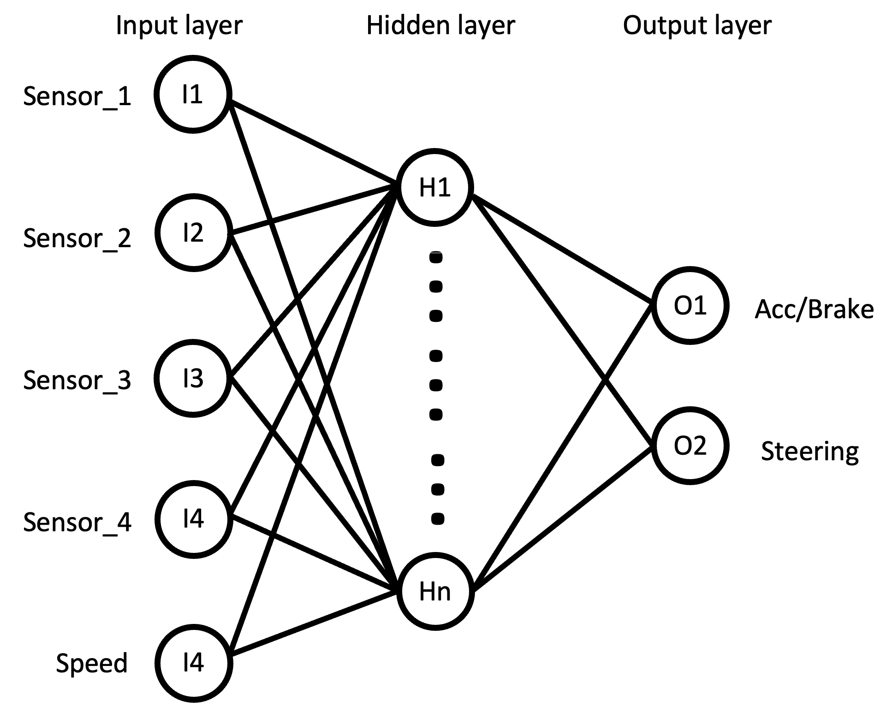
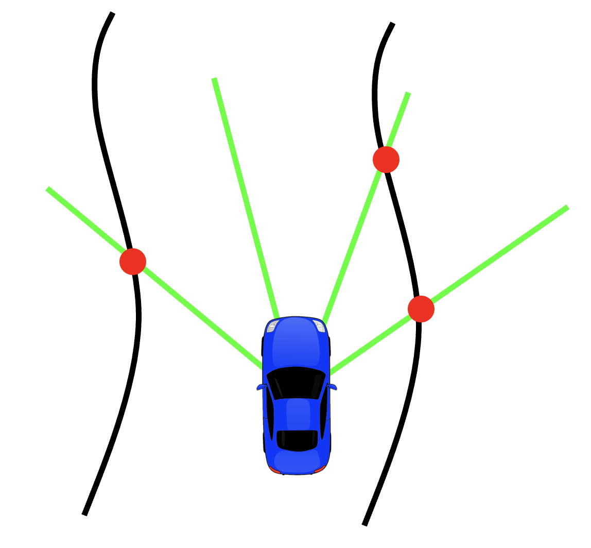
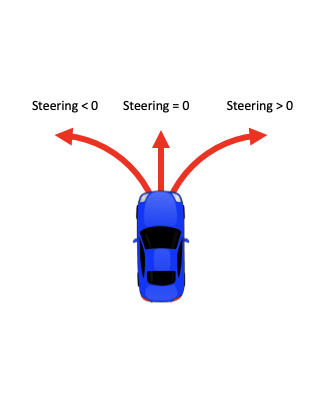

# CI-Project

<!-- TABLE OF CONTENTS -->
<details>
  <summary>Table of Contents</summary>
  <ol>
    <li>
      <a href="#about-the-project">About The Project</a>
    </li>
    <li>
      <a href="#getting-started">Getting Started</a>
      <ul>
        <li><a href="#prerequisites">Prerequisites</a></li>
        <li><a href="#installation">Installation</a></li>
      </ul>
    </li>
    <li><a href="#usage">Usage</a></li>
    <li>
      <a href="#configuration">Configuration</a></li>
      <ul>
        <li><a href="#experiment">Experiment</a></li>
        <li><a href="#neural_network">Neural_Network</a></li>
        <li><a href="#genetic">Genetic</a></li>
        <li><a href="#simulator">Simulator</a></li>
      <ul>
    <li><a href="#contact">Contact</a></li>
    <li><a href="#acknowledgments">Acknowledgments</a></li>
  </ol>
</details>

<!-- ABOUT THE PROJECT -->
## About The Project
This project trains a Neural Network with Gentic algorithms to achive autonomus driving capabilites using a car simulator.



<p align="right">(<a href="#readme-top">back to top</a>)</p>


<!-- GETTING STARTED -->
## Getting Started
To get a local copy up and running follow these simple example steps.

### Prerequisites
To run the software you will need
* python3 environment
* pip3

### Installation
1. Clone the repo

   ```sh
   git clone https://github.com/Izan00/CI-Project.git
   ```
2. Install the python packages from the [```requisites.txt```](requisites.txt) file

   ```pip3 install -r requisites.txt ```

<p align="right">(<a href="#readme-top">back to top</a>)</p>


<!-- USAGE EXAMPLES -->
## Usage
To use the code with the default configuration [```default_config.yaml```](/configs/default_config.yaml), simply run the [```main.py```](main.py) file with:

``` python3 main.py``` 

To change the configuration file use the ```-c``` flag:

``` python3 main.py -c new_config.yaml``` 


<p align="right">(<a href="#readme-top">back to top</a>)</p>

## Configuration
### Experiment    
Load experimet file name or use ```None``` to run sumulation: ```load_file_name```
Save experimet results file name or use ```None``` for discard: ```simulation_save_file```
Load multiple experimetns file index (change ```load_file_name``` to file root name) use ```0``` to load only one: ```multi_file```
    
### Neural_Network
* Number of input neurons: ```input_size```
* Number of input neurons: ```output_size```
* Maximum number of hidden neurons: ```max_neurons```
* Maximum neuron weight value: ```max_weight_value```
* Minimum neuron weight value: ```min_weight_value```
* Hidden layer activation funtion: ```hidden_layer_activation```
    * Identity: ```'identity' ```
    * Logistic: ```'logistic'```
    * Hyperbolic tangent: ```'tanh'```
* Output layer activation funtion: ```output_layer_activation```
    * Identity: ```'identity' ```
    * Logistic: ```'logistic'```
    * Hyperbolic tangent: ```'tanh'```
    
### Genetic
* Activate genetic model with binary genes: ```genetic_model```
* Bit encoding type: ```bit_encoding_type``` 
    * Gray: ```'gray'```
    * Binary: ```'binary'```
* Genetic model precison scaler: ```genetic_model_precision```   
* Number of gneration before stop: ```num_generations```
* Maximum fitness thershold stop criteria: ```max_fitness_stop_criteria```
* Fitness value saturation stop criteria: ```fitness_saturate_stop_criteria```
* Number of individuals in the population: ```sol_per_pop```
* Number of parest mating: ```num_parents_mating```
* Parents selection method: ```parent_selection_type```
    * Roulette Wheel: ```'rws'```
    * Tournament: ```'tournament'```
    * Rank: ```'rank'```
    * Random: ```'random'```
    * Steady State Slection: ```'sss'```
    * Stochastic universal selection: ```'sus'```
* Number of parents to keep: ```keep_parents```
* Number of invidual cinfronted in the tournament: ```k_tournament```
* Number of individuals to keep: ```keep_elitism```
* Crossover method: ```crossover_type```
    * Uniform: ```'uniform'```
    * Single point: ```'single_point'```
    * Two point: ```'two_points'```
    * Scattered: ```'scattered'```
* Crossove probability: ```crossover_probability```
* Mutation_type: ```mutation_type```
    * Random: ```'random'```
    * Swap: ```'swap'```
    * Inversion: ```'inversion'```
    * Scramble: ```'scramble'```
* Mutation probability: ```mutation_probability```
* Replace a gene value with a mutated one: ```mutation_by_replacement```
* Allow duplicate genes values: ```allow_duplicate_genes```
* Generation information display rate: ```verbose```
* Time delay between gerations: ```time_delay```
* Save all individuals in every generation: ```save_solutions```
* Save best individuals in every generation: ```save_best_solutions```

### Simulator
Road maximum angle deviation: ```road_max_angle```
Road maximum lateral deviation: ```road_max_deviation```
Road deviation spacing: ```road_spacing```
Road width: ```road_width```  
    
<!-- CONTACT -->
## Contact

Alvaro Armada - alvaro.armada@estudiantat.upc.edu

Izan Leal - izan.upc@gmail.com

Blanca Llauradó - blanca.llaurado@estudiantat.upc.edu

Magdalena Tolstoy - maria.magdalena.tolstoy@estudiantat.upc.edu

<p align="right">(<a href="#readme-top">back to top</a>)</p>


<!-- ACKNOWLEDGMENTS -->
## Acknowledgments

* [Hilicot](https://github.com/Hilicot/Neural_Network_NEAT)
* [PyGAD](https://pygad.readthedocs.io/en/latest/)

<p align="right">(<a href="#readme-top">back to top</a>)</p>
